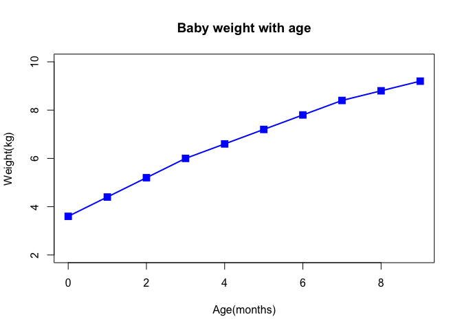

Class05 Data exploration and visualization in R
================
Yu Yan Kwan
2019-10-31

``` r
#Class5 Data Visualization 
x<-rnorm(1000)

#some summary stats
mean(x)
```

    ## [1] 0.02595051

``` r
sd(x)
```

    ## [1] 0.9916296

``` r
summary(x)
```

    ##     Min.  1st Qu.   Median     Mean  3rd Qu.     Max. 
    ## -3.13422 -0.63158  0.02213  0.02595  0.67231  3.55361

``` r
boxplot(x)
```

<!-- -->

``` r
hist(x)
rug(x)
```

<!-- -->

``` r
baby<-read.table("bimm143_05_rstats/weight_chart.txt",header = TRUE)

plot(baby$Age, baby$Weight,type="o",pch=15,cex=1.5,lwd="2",ylim=c(2,10),
     xlab="Age(months)",ylab="Weight(kg)",main="Baby weight with age", col="blue")
```

<!-- -->

``` r
mouse<-read.delim("bimm143_05_rstats/feature_counts.txt",header=TRUE)
barplot(mouse$Count, names.arg = mouse$Feature, horiz=TRUE, ylab="", 
        main="Number of features in the mouseGRCm38 genome",las=1,xlim=c(0,8000))
```

<!-- -->

``` r
par(mar=c(3.1,11.1,4.1,2))

mf<-read.delim("bimm143_05_rstats/male_female_counts.txt", header=TRUE)

barplot(mf$Count, names.arg = mf$Sample, col=c("blue2","red2"),las=2,ylab="Count")
```

<!-- -->
