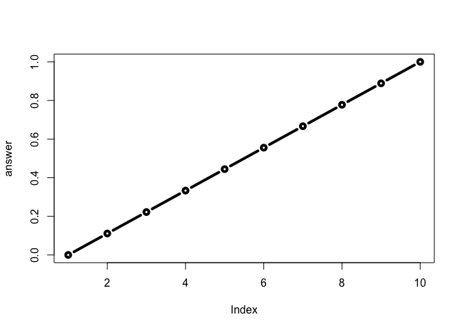

Class6 R functions
================

\#This is H1 This is my work from class6 in **BIMM 143**

``` r
#this is to demo a code chunk
plot(1:10)
```

<!-- -->

``` r
read.table("test1.txt",sep=",", header=T)
```

    ##   Col1 Col2 Col3
    ## 1    1    2    3
    ## 2    4    5    6
    ## 3    7    8    9
    ## 4    a    b    c

``` r
read.table("test2.txt",sep="$",header=TRUE)
```

    ##   Col1 Col2 Col3
    ## 1    1    2    3
    ## 2    4    5    6
    ## 3    7    8    9
    ## 4    a    b    c

``` r
add <- function(x, y=1) {
 # Sum the input x and y
 x + y}
```

``` r
add (1)
```

    ## [1] 2

``` r
add(5)
```

    ## [1] 6

``` r
add(c(1,2,3))
```

    ## [1] 2 3 4

``` r
add(c(1,2,3),4)
```

    ## [1] 5 6 7

A new function to re-scale data

``` r
rescale <- function(x) {
  rng<-range(x)
(x-rng[1])/(rng[2]-rng[1])
}
```

``` r
rescale(1:10)
```

    ##  [1] 0.0000000 0.1111111 0.2222222 0.3333333 0.4444444 0.5555556 0.6666667
    ##  [8] 0.7777778 0.8888889 1.0000000

``` r
rescale (c(1,2,NA,3,10))
```

    ## [1] NA NA NA NA NA

``` r
rescale2<-function(x){
  rng<-range(x,na.rm=TRUE)
  (x-rng[1])/(rng[2]-rng[1])
}
```

``` r
rescale2(c(1,2,NA,3,10))
```

    ## [1] 0.0000000 0.1111111        NA 0.2222222 1.0000000

``` r
rescale3 <- function(x, na.rm=TRUE, plot=FALSE) {
 rng <-range(x, na.rm=na.rm)
 print("Hello")
 answer <- (x - rng[1]) / (rng[2] - rng[1])
 print("is it me you are looking for?")
 if(plot) {
 plot(answer, typ="b", lwd=4)
 }
 print("I can see it in ...")
 return(answer)
}
```

``` r
rescale3(1:10, plot=TRUE)
```

    ## [1] "Hello"
    ## [1] "is it me you are looking for?"

<!-- -->

    ## [1] "I can see it in ..."

    ##  [1] 0.0000000 0.1111111 0.2222222 0.3333333 0.4444444 0.5555556 0.6666667
    ##  [8] 0.7777778 0.8888889 1.0000000

\#Section2 of hands-on sheet Install the **bio3d** package for sequence
and structure analysis

``` r
install.packages("bio3d",repos="http://cran.us.r-project.org")
```

    ## 
    ## The downloaded binary packages are in
    ##  /var/folders/00/96y0bcnd68v6p2kz773zl4900000gn/T//RtmptlndN9/downloaded_packages

``` r
library(bio3d)
hi <-function(x) {
s1 <- read.pdb(x) # kinase with drug
s1.chainA <- trim.pdb(s1, chain="A", elety="CA")
s1.b <- s1.chainA$atom$b
plotb3(s1.b, sse=s1.chainA, typ="l", ylab="Bfactor")
}
hi("4AKE")
```

    ##   Note: Accessing on-line PDB file

<!-- -->

``` r
hi("1AKE")
```

    ##   Note: Accessing on-line PDB file
    ##    PDB has ALT records, taking A only, rm.alt=TRUE

<!-- -->

``` r
hi("1E4Y")
```

    ##   Note: Accessing on-line PDB file

<!-- -->

\#\#Practice reading files (again…)
