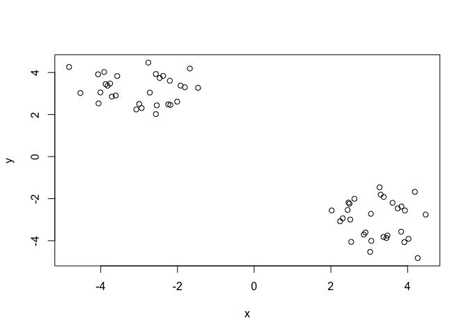
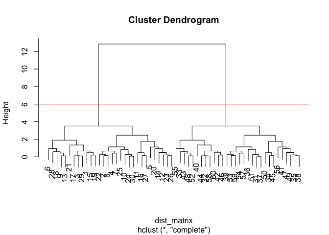

Class 08 Machine Learning
================
Yu Yan Kwan
10/24/2019

\#\#K means clustering

``` r
#Generate some example data for clustering
tmp<-c(rnorm(30,-3),rnorm(30,3))
x<-cbind(x=tmp,y=rev(tmp))
plot(x)
```

<!-- -->

``` r
k<-kmeans(x,centers=2,nstart=20)
```

``` r
k
```

    ## K-means clustering with 2 clusters of sizes 30, 30
    ## 
    ## Cluster means:
    ##           x         y
    ## 1  3.218057 -3.007915
    ## 2 -3.007915  3.218057
    ## 
    ## Clustering vector:
    ##  [1] 2 2 2 2 2 2 2 2 2 2 2 2 2 2 2 2 2 2 2 2 2 2 2 2 2 2 2 2 2 2 1 1 1 1 1
    ## [36] 1 1 1 1 1 1 1 1 1 1 1 1 1 1 1 1 1 1 1 1 1 1 1 1 1
    ## 
    ## Within cluster sum of squares by cluster:
    ## [1] 37.21795 37.21795
    ##  (between_SS / total_SS =  94.0 %)
    ## 
    ## Available components:
    ## 
    ## [1] "cluster"      "centers"      "totss"        "withinss"    
    ## [5] "tot.withinss" "betweenss"    "size"         "iter"        
    ## [9] "ifault"

Q. How many points are in each cluster? Q. What “component” of your
result object details -cluster size? -cluster assignment/membership?
-cluster
    center?

``` r
k$size
```

    ## [1] 30 30

``` r
k$cluster
```

    ##  [1] 2 2 2 2 2 2 2 2 2 2 2 2 2 2 2 2 2 2 2 2 2 2 2 2 2 2 2 2 2 2 1 1 1 1 1
    ## [36] 1 1 1 1 1 1 1 1 1 1 1 1 1 1 1 1 1 1 1 1 1 1 1 1 1

``` r
k$centers
```

    ##           x         y
    ## 1  3.218057 -3.007915
    ## 2 -3.007915  3.218057

Plot x colored by tehe kmeans cluster assignment and add cluster centers
as blue points \#pch makes the point a square

``` r
plot(x,col=k$cluster)
points(k$centers,col="blue",pch=15)
```

<!-- -->

\#\#Hierarchical clutering in R The “hclust()” function requires a
distance matrix as input. You can get this from the “dist()” function.
Often see “hclust()” and “dist()” together.

``` r
# First we need to calculate point (dis)similarity
#   as the Euclidean distance between observations
dist_matrix <- dist(x)
# The hclust() function returns a hierarchical
#  clustering model
hc <- hclust(d = dist_matrix)
# the print method is not so useful here
hc
```

    ## 
    ## Call:
    ## hclust(d = dist_matrix)
    ## 
    ## Cluster method   : complete 
    ## Distance         : euclidean 
    ## Number of objects: 60

``` r
plot(hc)
abline(h=6,col="red")
```

<!-- -->

``` r
grps<-cutree(hc,h=6)
```

\#Step1. Generate some example data for clustering

``` r
x <- rbind(
  matrix(rnorm(100, mean=0, sd = 0.3), ncol = 2),   # c1
  matrix(rnorm(100, mean = 1, sd = 0.3), ncol = 2), # c2
  matrix(c(rnorm(50, mean = 1, sd = 0.3),           # c3
           rnorm(50, mean = 0, sd = 0.3)), ncol = 2))
colnames(x) <- c("x", "y")
```

\#Step2. Plot the data without clustering

``` r
plot(x)
```

<!-- -->

# Step 3. Generate colors for known clusters

# (just so we can compare to hclust results)

``` r
col <- as.factor( rep(c("c1","c2","c3"), each=50) )
plot(x, col=col)
```

<!-- --> \#There are
some black, green and red point overlapping.

Q. Use the dist(), hclust(), plot() and cutree() functions to return 2
and 3 clusters Q. How does this compare to your known ‘col’ groups?

``` r
#clustering
hc<-hclust(dist(x))
#draw tree
plot(hc)
abline(h=2,col="red")
```

<!-- -->

``` r
#cut the tree into clusters/groups
groups<-cutree(hc,h=3)
groups
```

    ##   [1] 1 1 1 1 1 1 1 1 1 1 1 1 1 1 1 1 1 1 1 1 1 1 1 1 1 1 1 1 1 1 1 1 1 1 1
    ##  [36] 1 1 1 1 1 1 1 1 1 1 1 1 1 1 1 1 1 1 1 1 1 1 1 1 1 1 1 1 1 1 1 1 1 1 1
    ##  [71] 1 1 1 1 1 1 1 1 1 1 1 1 1 1 1 1 1 1 1 1 1 1 1 1 1 1 1 1 1 1 1 1 1 1 1
    ## [106] 1 1 1 1 1 1 1 1 1 1 1 1 1 1 1 1 1 1 1 1 1 1 1 1 1 1 1 1 1 1 1 1 1 1 1
    ## [141] 1 1 1 1 1 1 1 1 1 1

Plot the data colored by the hclust result with k=3

``` r
plot(x,col=groups)
```

<!-- -->

How many points in each cluster?

``` r
table(groups,col)
```

    ##       col
    ## groups c1 c2 c3
    ##      1 50 50 50

\#the table tells you that cluster 1 has 94 members, cluster 2 has 56
members

``` r
mydata <- read.csv("https://tinyurl.com/expression-CSV",
row.names=1)

head(mydata)
```

    ##        wt1 wt2  wt3  wt4 wt5 ko1 ko2 ko3 ko4 ko5
    ## gene1  439 458  408  429 420  90  88  86  90  93
    ## gene2  219 200  204  210 187 427 423 434 433 426
    ## gene3 1006 989 1030 1017 973 252 237 238 226 210
    ## gene4  783 792  829  856 760 849 856 835 885 894
    ## gene5  181 249  204  244 225 277 305 272 270 279
    ## gene6  460 502  491  491 493 612 594 577 618 638

PCA with the \*\*prcomp()\* function

``` r
## lets do PCA
pca <- prcomp(t(mydata), scale=TRUE)
## See what is returned by the prcomp() function  attributes(pca)
attributes(pca)
```

    ## $names
    ## [1] "sdev"     "rotation" "center"   "scale"    "x"       
    ## 
    ## $class
    ## [1] "prcomp"

``` r
## A basic PC1 vs PC2 2-D plot  plot(pca$x[,1], pca$x[,2])
plot(pca$x[,1], pca$x[,2])
```

<!-- -->

``` r
## Precent variance is often more informative to look at  
pca.var <- pca$sdev^2
pca.var.per <- round(pca.var/sum(pca.var)*100, 1)
pca.var.per
```

    ##  [1] 92.6  2.3  1.1  1.1  0.8  0.7  0.6  0.4  0.4  0.0

``` r
pca.var <- pca$sdev^2
pca.var.per <- round(pca.var/sum(pca.var)*100, 1)

barplot(pca.var.per, main="Scree Plot",
xlab="Principal Component", ylab="Percent Variation")
```

<!-- -->

``` r
plot(pca$x[,1], pca$x[,2], 
     col=c("red","red","red","red","red","blue","blue","blue","blue","blue"))
```

<!-- -->

\#\#Hands on

``` r
x <- read.csv("UK_foods.csv",row.names=1)
x
```

    ##                     England Wales Scotland N.Ireland
    ## Cheese                  105   103      103        66
    ## Carcass_meat            245   227      242       267
    ## Other_meat              685   803      750       586
    ## Fish                    147   160      122        93
    ## Fats_and_oils           193   235      184       209
    ## Sugars                  156   175      147       139
    ## Fresh_potatoes          720   874      566      1033
    ## Fresh_Veg               253   265      171       143
    ## Other_Veg               488   570      418       355
    ## Processed_potatoes      198   203      220       187
    ## Processed_Veg           360   365      337       334
    ## Fresh_fruit            1102  1137      957       674
    ## Cereals                1472  1582     1462      1494
    ## Beverages                57    73       53        47
    ## Soft_drinks            1374  1256     1572      1506
    ## Alcoholic_drinks        375   475      458       135
    ## Confectionery            54    64       62        41

# Note how the minus indexing works

``` r
rownames(x) <- x[,1]
x <- x[,-1]
head(x)
```

    ##     Wales Scotland N.Ireland
    ## 105   103      103        66
    ## 245   227      242       267
    ## 685   803      750       586
    ## 147   160      122        93
    ## 193   235      184       209
    ## 156   175      147       139

``` r
dim(x)
```

    ## [1] 17  3

``` r
barplot(as.matrix(x), beside=T, col=rainbow(nrow(x)))
```

<!-- -->

``` r
pairs(x, col=rainbow(10), pch=16)
```

<!-- -->

``` r
pca <- prcomp( t(x) )
summary(pca)
```

    ## Importance of components:
    ##                             PC1      PC2       PC3
    ## Standard deviation     379.8991 260.5533 1.515e-13
    ## Proportion of Variance   0.6801   0.3199 0.000e+00
    ## Cumulative Proportion    0.6801   1.0000 1.000e+00
