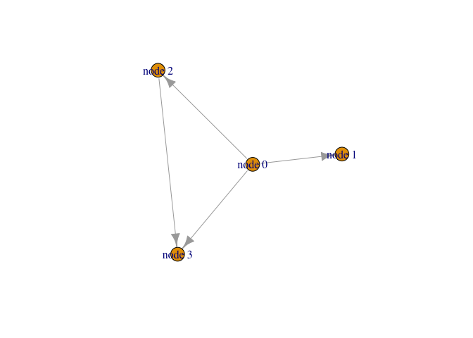
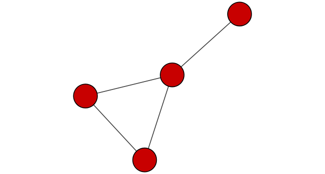
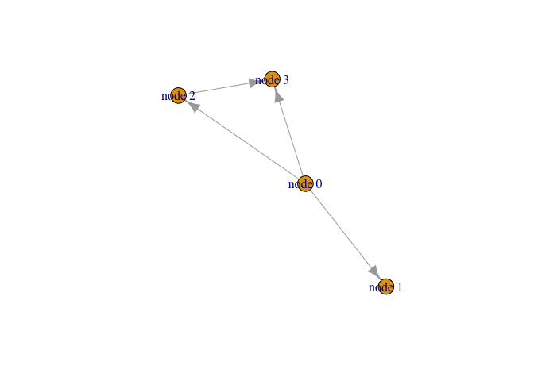
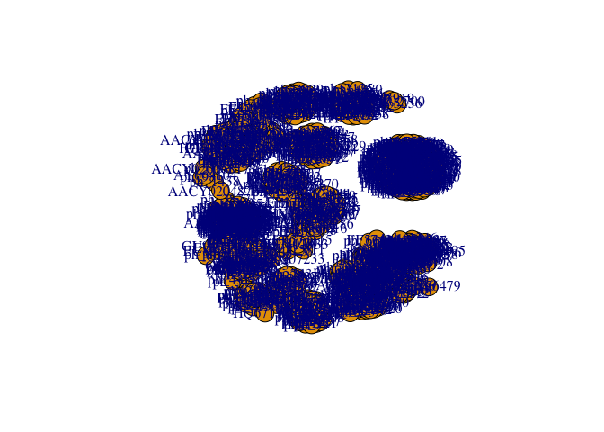
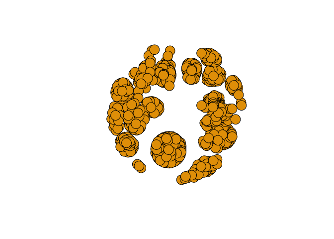
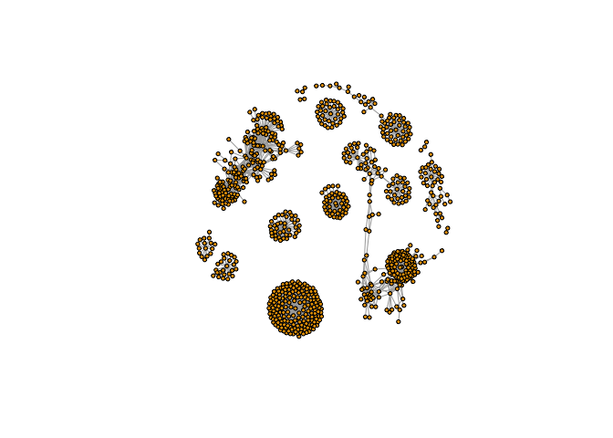

Class17
================
Yu Yan Kwan
11/19/2019

\#\#Metagenomics co-occureence networks Here examine data from the Tara
Ocean project on bacteria in ocean water samples from around the world.
We will use the **igraph** package from CRAN and the **RCy3** package
from bioconductor to build and visualize networks of this data

``` r
library("RCy3")
library(igraph)
```

    ## 
    ## Attaching package: 'igraph'

    ## The following objects are masked from 'package:stats':
    ## 
    ##     decompose, spectrum

    ## The following object is masked from 'package:base':
    ## 
    ##     union

``` r
library(RColorBrewer)
```

``` r
cytoscapePing()
```

    ## [1] "You are connected to Cytoscape!"

``` r
cytoscapeVersionInfo()
```

    ##       apiVersion cytoscapeVersion 
    ##             "v1"          "3.7.2"

``` r
g<-makeSimpleIgraph()
createNetworkFromIgraph(g,"myGraph")
```

    ## Loading data...
    ## Applying default style...
    ## Applying preferred layout...

    ## networkSUID 
    ##          80

``` r
plot(g)
```

<!-- -->

``` r
fig<-exportImage(filename="demo",type="png",heigh=350)
```

    ## Warning: This file already exists. A Cytoscape popup 
    ##                 will be generated to confirm overwrite.

Insert this image into Rmd project

``` r

```

<!-- -->

``` r
setVisualStyle("Marquee")
```

    ##                 message 
    ## "Visual Style applied."

``` r
styles<-getVisualStyleNames()
styles
```

    ##  [1] "Solid"                "BioPAX"               "Universe"            
    ##  [4] "Sample1"              "Curved"               "default"             
    ##  [7] "Directed"             "default black"        "BioPAX_SIF"          
    ## [10] "Gradient1"            "Marquee"              "Nested Network Style"
    ## [13] "size_rank"            "Minimal"              "Sample2"             
    ## [16] "Big Labels"           "Ripple"               "Sample3"

``` r
plot(g)
```

<!-- -->

``` r
## scripts for processing located in "inst/data-raw/"
prok_vir_cor <- read.delim("virus_prok_cor_abundant.tsv", stringsAsFactors = FALSE)

## Have a peak at the first 6 rows
head(prok_vir_cor)
```

    ##       Var1          Var2    weight
    ## 1  ph_1061 AACY020068177 0.8555342
    ## 2  ph_1258 AACY020207233 0.8055750
    ## 3  ph_3164 AACY020207233 0.8122517
    ## 4  ph_1033 AACY020255495 0.8487498
    ## 5 ph_10996 AACY020255495 0.8734617
    ## 6 ph_11038 AACY020255495 0.8740782

\#use the igraph package to convert the co-occurrence dataframe into a
network that we can send to Cytoscape

``` r
g <- graph.data.frame(prok_vir_cor, directed = FALSE)
class(g)
```

    ## [1] "igraph"

``` r
g
```

    ## IGRAPH 315c8f9 UNW- 845 1544 -- 
    ## + attr: name (v/c), weight (e/n)
    ## + edges from 315c8f9 (vertex names):
    ##  [1] ph_1061 --AACY020068177 ph_1258 --AACY020207233
    ##  [3] ph_3164 --AACY020207233 ph_1033 --AACY020255495
    ##  [5] ph_10996--AACY020255495 ph_11038--AACY020255495
    ##  [7] ph_11040--AACY020255495 ph_11048--AACY020255495
    ##  [9] ph_11096--AACY020255495 ph_1113 --AACY020255495
    ## [11] ph_1208 --AACY020255495 ph_13207--AACY020255495
    ## [13] ph_1346 --AACY020255495 ph_14679--AACY020255495
    ## [15] ph_1572 --AACY020255495 ph_16045--AACY020255495
    ## + ... omitted several edges

``` r
plot(g)
```

<!-- --> \#This is a
hot-mess\! Lets turn of the blue text labels

``` r
plot(g, vertex.label=NA)
```

<!-- --> \#The
nodes/vertex are too big. Lets make them smaller…

``` r
plot(g, vertex.size=3, vertex.label=NA)
```

<!-- -->
