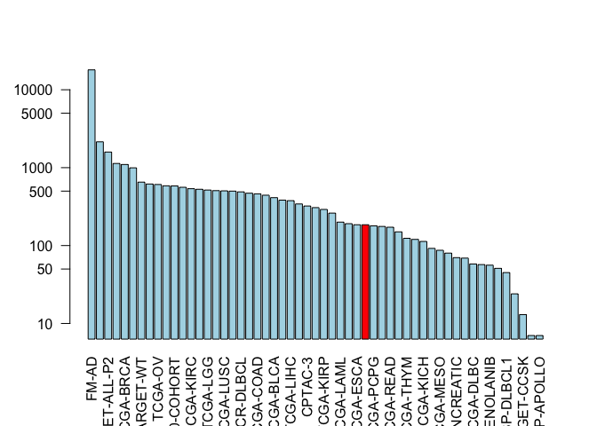

Class18
================
Yu Yan Kwan
11/26/2019

``` r
library(GenomicDataCommons)
```

    ## Loading required package: magrittr

    ## 
    ## Attaching package: 'GenomicDataCommons'

    ## The following object is masked from 'package:stats':
    ## 
    ##     filter

``` r
library(TCGAbiolinks)
library(maftools)
```

Now let’s check on GDC status:

``` r
status()
```

    ## $commit
    ## [1] "955a105f3f2ba797e1d9d8de013226a495feae56"
    ## 
    ## $data_release
    ## [1] "Data Release 20.0 - November 11, 2019"
    ## 
    ## $status
    ## [1] "OK"
    ## 
    ## $tag
    ## [1] "1.23.0"
    ## 
    ## $version
    ## [1] 1

``` r
projects <- getGDCprojects()
head(projects)
```

    ##   dbgap_accession_number
    ## 1                   <NA>
    ## 2                   <NA>
    ## 3              phs000466
    ## 4                   <NA>
    ## 5              phs000467
    ## 6              phs000465
    ##                                                                                                                                           disease_type
    ## 1                                                                                                                                Mesothelial Neoplasms
    ## 2                                                                                                                         Adenomas and Adenocarcinomas
    ## 3                                                                                                                  Complex Mixed and Stromal Neoplasms
    ## 4 Myomatous Neoplasms, Soft Tissue Tumors and Sarcomas, NOS, Fibromatous Neoplasms, Lipomatous Neoplasms, Nerve Sheath Tumors, Synovial-like Neoplasms
    ## 5                                                                                                       Neuroepitheliomatous Neoplasms, Not Applicable
    ## 6                                                                                                                    Myeloid Leukemias, Not Applicable
    ##   releasable released state
    ## 1      FALSE     TRUE  open
    ## 2      FALSE     TRUE  open
    ## 3      FALSE     TRUE  open
    ## 4      FALSE     TRUE  open
    ## 5       TRUE     TRUE  open
    ## 6       TRUE     TRUE  open
    ##                                                                                                                                                                                                                                                                                                                                                                                                                                                                                                                                                                                                                   primary_site
    ## 1                                                                                                                                                                                                                                                                                                                                                                                                                                                                                                                                                                            Heart, mediastinum, and pleura, Bronchus and lung
    ## 2                                                                                                                                                                                                                                                                                                                                                                                                                                                                                                                                                                                                                Adrenal gland
    ## 3                                                                                                                                                                                                                                                                                                                                                                                                                                                                                                                                                                                                                       Kidney
    ## 4                                                                                                                                                                                                                                                                                        Corpus uteri, Stomach, Other and unspecified parts of tongue, Meninges, Other and unspecified male genital organs, Colon, Connective, subcutaneous and other soft tissues, Bones, joints and articular cartilage of limbs, Ovary, Retroperitoneum and peritoneum, Peripheral nerves and autonomic nervous system, Uterus, NOS, Kidney
    ## 5 Heart, mediastinum, and pleura, Stomach, Bones, joints and articular cartilage of other and unspecified sites, Lymph nodes, Liver and intrahepatic bile ducts, Unknown, Uterus, NOS, Skin, Other endocrine glands and related structures, Adrenal gland, Renal pelvis, Connective, subcutaneous and other soft tissues, Bones, joints and articular cartilage of limbs, Other and ill-defined sites, Meninges, Spinal cord, cranial nerves, and other parts of central nervous system, Retroperitoneum and peritoneum, Peripheral nerves and autonomic nervous system, Hematopoietic and reticuloendothelial systems, Kidney
    ## 6                                                                                                                                                                                                                                                                                                                                                                                                                                                                                                                                                                       Unknown, Hematopoietic and reticuloendothelial systems
    ##    project_id          id                             name tumor
    ## 1   TCGA-MESO   TCGA-MESO                     Mesothelioma  MESO
    ## 2    TCGA-ACC    TCGA-ACC         Adrenocortical Carcinoma   ACC
    ## 3 TARGET-CCSK TARGET-CCSK Clear Cell Sarcoma of the Kidney  CCSK
    ## 4   TCGA-SARC   TCGA-SARC                          Sarcoma  SARC
    ## 5  TARGET-NBL  TARGET-NBL                    Neuroblastoma   NBL
    ## 6  TARGET-AML  TARGET-AML           Acute Myeloid Leukemia   AML

``` r
cases_by_project <- cases() %>%
  facet("project.project_id") %>%
  aggregations()
head(cases_by_project)
```

    ## $project.project_id
    ##                      key doc_count
    ## 1                  FM-AD     18004
    ## 2             TARGET-AML      2146
    ## 3          TARGET-ALL-P2      1587
    ## 4             TARGET-NBL      1132
    ## 5              TCGA-BRCA      1098
    ## 6          MMRF-COMMPASS       995
    ## 7              TARGET-WT       652
    ## 8               TCGA-GBM       617
    ## 9                TCGA-OV       608
    ## 10             TCGA-LUAD       585
    ## 11     BEATAML1.0-COHORT       583
    ## 12             TCGA-UCEC       560
    ## 13             TCGA-KIRC       537
    ## 14             TCGA-HNSC       528
    ## 15              TCGA-LGG       516
    ## 16             TCGA-THCA       507
    ## 17             TCGA-LUSC       504
    ## 18             TCGA-PRAD       500
    ## 19          NCICCR-DLBCL       489
    ## 20             TCGA-SKCM       470
    ## 21             TCGA-COAD       461
    ## 22             TCGA-STAD       443
    ## 23             TCGA-BLCA       412
    ## 24             TARGET-OS       383
    ## 25             TCGA-LIHC       377
    ## 26               CPTAC-2       342
    ## 27               CPTAC-3       322
    ## 28             TCGA-CESC       307
    ## 29             TCGA-KIRP       291
    ## 30             TCGA-SARC       261
    ## 31             TCGA-LAML       200
    ## 32         TARGET-ALL-P3       191
    ## 33             TCGA-ESCA       185
    ## 34             TCGA-PAAD       185
    ## 35             TCGA-PCPG       179
    ## 36              OHSU-CNL       176
    ## 37             TCGA-READ       172
    ## 38             TCGA-TGCT       150
    ## 39             TCGA-THYM       124
    ## 40            CGCI-BLGSP       120
    ## 41             TCGA-KICH       113
    ## 42              TCGA-ACC        92
    ## 43             TCGA-MESO        87
    ## 44              TCGA-UVM        80
    ## 45   ORGANOID-PANCREATIC        70
    ## 46             TARGET-RT        69
    ## 47             TCGA-DLBC        58
    ## 48              TCGA-UCS        57
    ## 49 BEATAML1.0-CRENOLANIB        56
    ## 50             TCGA-CHOL        51
    ## 51           CTSP-DLBCL1        45
    ## 52         TARGET-ALL-P1        24
    ## 53           TARGET-CCSK        13
    ## 54             HCMI-CMDC         7
    ## 55        VAREPOP-APOLLO         7

``` r
x <- cases_by_project$project.project_id

# Make a custom color vector for our plot
colvec <- rep("lightblue", nrow(x))
colvec[(x$key=="TCGA-PAAD")] <- "red"
colvec
```

    ##  [1] "lightblue" "lightblue" "lightblue" "lightblue" "lightblue"
    ##  [6] "lightblue" "lightblue" "lightblue" "lightblue" "lightblue"
    ## [11] "lightblue" "lightblue" "lightblue" "lightblue" "lightblue"
    ## [16] "lightblue" "lightblue" "lightblue" "lightblue" "lightblue"
    ## [21] "lightblue" "lightblue" "lightblue" "lightblue" "lightblue"
    ## [26] "lightblue" "lightblue" "lightblue" "lightblue" "lightblue"
    ## [31] "lightblue" "lightblue" "lightblue" "red"       "lightblue"
    ## [36] "lightblue" "lightblue" "lightblue" "lightblue" "lightblue"
    ## [41] "lightblue" "lightblue" "lightblue" "lightblue" "lightblue"
    ## [46] "lightblue" "lightblue" "lightblue" "lightblue" "lightblue"
    ## [51] "lightblue" "lightblue" "lightblue" "lightblue" "lightblue"

``` r
# Plot with 'log' for y axis and rotate labels with 'las'
#par(___)  
barplot(x$doc_count, names.arg=x$key, log="y", col=colvec, las=2)
```

<!-- -->

\#Part 2 Handout

``` r
library(bio3d)
seqs <- read.fasta("lecture18_sequences.fa")
seqs
```

    ##              1        .         .         .         .         .         60 
    ## P53_wt       MEEPQSDPSVEPPLSQETFSDLWKLLPENNVLSPLPSQAMDDLMLSPDDIEQWFTEDPGP
    ## P53_mutant   MEEPQSDPSVEPPLSQETFSDLWKLLPENNVLSPLPSQAMLDLMLSPDDIEQWFTEDPGP
    ##              **************************************** ******************* 
    ##              1        .         .         .         .         .         60 
    ## 
    ##             61        .         .         .         .         .         120 
    ## P53_wt       DEAPRMPEAAPPVAPAPAAPTPAAPAPAPSWPLSSSVPSQKTYQGSYGFRLGFLHSGTAK
    ## P53_mutant   DEAPWMPEAAPPVAPAPAAPTPAAPAPAPSWPLSSSVPSQKTYQGSYGFRLGFLHSGTAK
    ##              **** ******************************************************* 
    ##             61        .         .         .         .         .         120 
    ## 
    ##            121        .         .         .         .         .         180 
    ## P53_wt       SVTCTYSPALNKMFCQLAKTCPVQLWVDSTPPPGTRVRAMAIYKQSQHMTEVVRRCPHHE
    ## P53_mutant   SVTCTYSPALNKMFCQLAKTCPVQLWVDSTPPPGTRVRAMAIYKQSQHMTEVVRRCPHHE
    ##              ************************************************************ 
    ##            121        .         .         .         .         .         180 
    ## 
    ##            181        .         .         .         .         .         240 
    ## P53_wt       RCSDSDGLAPPQHLIRVEGNLRVEYLDDRNTFRHSVVVPYEPPEVGSDCTTIHYNYMCNS
    ## P53_mutant   RCSDSDGLAPPQHLIRVEGNLRVEYLDDRNTFVHSVVVPYEPPEVGSDCTTIHYNYMCNS
    ##              ******************************** *************************** 
    ##            181        .         .         .         .         .         240 
    ## 
    ##            241        .         .         .         .         .         300 
    ## P53_wt       SCMGGMNRRPILTIITLEDSSGNLLGRNSFEVRVCACPGRDRRTEEENLRKKGEPHHELP
    ## P53_mutant   SCMGGMNRRPILTIITLEV-----------------------------------------
    ##              ******************                                           
    ##            241        .         .         .         .         .         300 
    ## 
    ##            301        .         .         .         .         .         360 
    ## P53_wt       PGSTKRALPNNTSSSPQPKKKPLDGEYFTLQIRGRERFEMFRELNEALELKDAQAGKEPG
    ## P53_mutant   ------------------------------------------------------------
    ##                                                                           
    ##            301        .         .         .         .         .         360 
    ## 
    ##            361        .         .         .  393 
    ## P53_wt       GSRAHSSHLKSKKGQSTSRHKKLMFKTEGPDSD
    ## P53_mutant   ---------------------------------
    ##                                                
    ##            361        .         .         .  393 
    ## 
    ## Call:
    ##   read.fasta(file = "lecture18_sequences.fa")
    ## 
    ## Class:
    ##   fasta
    ## 
    ## Alignment dimensions:
    ##   2 sequence rows; 393 position columns (259 non-gap, 134 gap) 
    ## 
    ## + attr: id, ali, call

``` r
## Calculate positional identity scores
ide <- conserv(seqs$ali, method="identity")
mutant.sites<- which(ide < 1)
```

``` r
## Exclude gap possitions from analysis
library(bio3d)
gaps<-gap.inspect(seqs)
mutant.sites <- mutant.sites[mutant.sites %in% gaps$f.inds]
mutant.sites
```

    ## [1]  41  65 213 259

``` r
## Make a "names" label for our output sequences (one per mutant)
mutant.names <- paste0(seqs$ali["P53_wt",mutant.sites],
                       mutant.sites,
                       seqs$ali["P53_mutant",mutant.sites])
mutant.names
```

    ## [1] "D41L"  "R65W"  "R213V" "D259V"

``` r
## Sequence positions surounding each mutant site
start.position <- mutant.sites - 8
end.position <-  mutant.sites + 8

# Blank matrix to store sub-sequences
store.seqs <- matrix("-", nrow=length(mutant.sites), ncol=17)
rownames(store.seqs) <- mutant.names

## Extract each sub-sequence
for(i in 1:length(mutant.sites)) {
  store.seqs[i,] <- seqs$ali["P53_mutant",start.position[i]:end.position[i]]
}

store.seqs
```

    ##       [,1] [,2] [,3] [,4] [,5] [,6] [,7] [,8] [,9] [,10] [,11] [,12] [,13]
    ## D41L  "S"  "P"  "L"  "P"  "S"  "Q"  "A"  "M"  "L"  "D"   "L"   "M"   "L"  
    ## R65W  "D"  "P"  "G"  "P"  "D"  "E"  "A"  "P"  "W"  "M"   "P"   "E"   "A"  
    ## R213V "Y"  "L"  "D"  "D"  "R"  "N"  "T"  "F"  "V"  "H"   "S"   "V"   "V"  
    ## D259V "I"  "L"  "T"  "I"  "I"  "T"  "L"  "E"  "V"  "-"   "-"   "-"   "-"  
    ##       [,14] [,15] [,16] [,17]
    ## D41L  "S"   "P"   "D"   "D"  
    ## R65W  "A"   "P"   "P"   "V"  
    ## R213V "V"   "P"   "Y"   "E"  
    ## D259V "-"   "-"   "-"   "-"

``` r
## Output a FASTA file for further analysis
write.fasta(seqs=store.seqs, ids=mutant.names, file="subsequences.fa")
```
